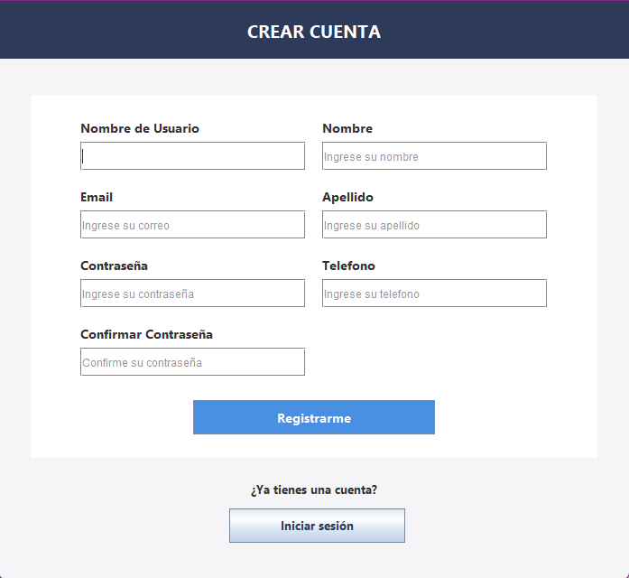
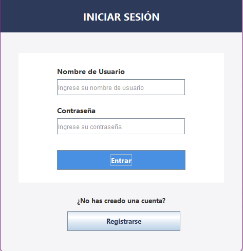
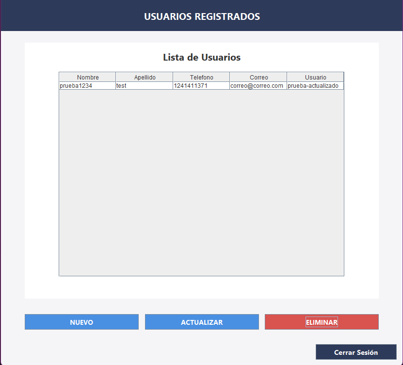

# Programacion I Tarea 4 - User Manager

[](https://github.com/xNeuNoRo/p1_tarea4_usermanager/)
[](https://gradle.org/)
[](./LICENSE)

> Proyecto de práctica: CRUD de Usuarios en Java Swing<br>Aplicación creada con Netbeans Apache.  
<br>
> Ángel González Muñoz - Mat. 2025-1122

## Tabla de contenidos

- [Contenido](#contenido)
- [Arquitectura (MVC)](#arquitectura-mvc)
- [Estructura](#estructura)
- [Screenshots](#screenshots)
- [Cómo ejecutarlo](#como-ejecutarlo)
- [Nota](#nota)

## Contenido

- POO aplicada (Encapsulamiento, Herencia, etc.)
- Patrones de diseño (Singleton)
- Arquitectura MVC (Model-View-Controller)
- Medidas de seguridad tales como: 
   > - Hashear la contraseña (con fallback a contraseñas planas, en caso de no estar hasheadas)
   > - Solicitar la contraseña actual antes de actualizar
- Detalles extra como:
   > - Rellenar los campos automáticamente al editar un usuario
   > - Dialogs y ventanas de confirmación para un mejor feedback al usuario

## Arquitectura (MVC)

- **Model** → Person, User, UserRepository, UserService  
- **View** → LoginView, RegisterView, UserManagementView, etc.  
- **Controller** → LoginController, RegisterController, UserController  

**Flujo general:**  
View → Controller → Service → Repository → Database

## Estructura

```bash
user-manager/
├── app/
│   ├── src/
│   │   └── main/java/com/tarea4/usermanager/ # Paquete principal del proyecto
│   │       ├── config/ # Configuracion general y de la base de datos
│   │       │   ├── AppConfig.java # Configuracion de la aplicacion (cargada desde el application.properties)
│   │       │   └── DatabaseConnection.java # Conexion a la base de datos (SINGLETON)
│   │       ├── controllers/ # Controladores que manejan la logica de las vistas
│   │       │   ├── LoginController.java # Controlador para manejar el login del usuario
│   │       │   ├── RegisterController.java # Controlador para manejar el registro de un usuario
│   │       │   └── UserController.java # Controlador para administrar los usuarios (CRUD)
│   │       ├── models/ # Modelos y logica de la app
│   │       │   ├── Person.java # Clase abstracta persona
│   │       │   ├── User.java # Clase usuario que hereda la clase persona
│   │       │   ├── UserRepository.java # Repositorio de funciones que se encarga de todo lo referente a la base de datos
│   │       │   └── UserService.java # Servicio encargado de gestionar toda la logica de la app consumiendo el repositorio
│   │       ├── utils/ # Funciones adicionales
│   │       │   └── PasswordUtils.java # Hashing y comparacion de contraseñas
│   │       ├── views/ # Interfaces graficas construidas en Netbeans Apache
│   │       │   ├── LoginView.form
│   │       │   ├── LoginView.java # Vista del login
│   │       │   ├── RegisterView.form
│   │       │   ├── RegisterView.java # Vista de registro de usuarios
│   │       │   ├── UserFormDialog.form
│   │       │   ├── UserFormDialog.java # Vista de formulario de usuarios (reutilizado tanto para edicion como creacion)
│   │       │   ├── UserManagementView.form
│   │       │   └── UserManagementView.java # Vista donde se encuentran las acciones del CRUD para administrar los usuarios
│   │       └── App.java # Clase principal que se encarga de ejecutar la vista del Login
│   └── build.gradle # Configuracion de gradle
└── settings.gradle # Configuracion de gradle
```

## Screenshots

<div style="display: grid; grid-template-columns: repeat(3, 1fr); column-gap: 1rem" align="center">
  
  
  
</div>

## Como ejecutarlo

1. Clonar el repositorio con
```bash
git clone https://github.com/xNeuNoRo/p1_tarea4_usermanager angelgonzalez_tarea4
```
2. Crear la base de datos con el script SQL [(Leer nota)](#nota)
3. Crear `application.properties` con tus credenciales [(Leer nota)](#nota)
4. Ejecutar el proyecto desde NetBeans o usando:
```bash
gradle run
```

## Nota

Deberas crear la tabla "usuarios" en tu base de datos MySQL con el siguiente query:
<br>_(Es totalmente compatible con la estructura de la tabla usuarios en la BD almacenitla)_
```sql
CREATE TABLE usuarios (
    idUser INT NOT NULL AUTO_INCREMENT PRIMARY KEY,
    UserName VARCHAR(50) NOT NULL,
    Nombre VARCHAR(100) NOT NULL,
    Apellido VARCHAR(100) NOT NULL,
    Email VARCHAR(150) NOT NULL,
    Telefono VARCHAR(20) NOT NULL,
    Password VARCHAR(255) NOT NULL
);
```

Tambien, debes crear en la carpeta de "resources" el archivo de "application.properties"
<br>Y agregar las siguientes variables para el correcto funcionamiento del programa:

```properties
# Aqui pones el url de tu base de datos MySQL incluyendo el prefijo 'jdbc'
db.url=jdbc:mysql://localhost:3306/p1tarea4

# Aqui pasas las credenciales de tu base de datos
db.user=root
db.pass=neunoro_dev
```

Basicamente sigue la estructura del "application.example.properties".
<br>Asegurate de no dejar espacios accidentales para que todo funcione debidamente.

> Ojo: Esta base de datos de ejemplo corre en un contenedor Docker local, por lo que el usuario y contraseña usados en este archivo NO te funcionarán y existen únicamente para fines prácticos del proyecto.